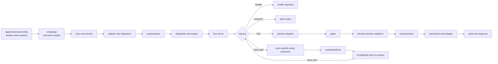

# App-Stack overview

App-Stack is a configuration-first application framework. An app declares models, views, and queries in YAML; the framework compiles those declarations at boot and uses the resulting runtime objects to serve the database, HTTP API, policy gates, and UI. Code remains the escape hatch for behaviour that is genuinely specific.

The central rule is the model spine:

```text
configuration ──parse/compile──▶ typed runtime ──┬──▶ database
                                                  ├──▶ HTTP API
                                                  ├──▶ policy and logic
                                                  └──▶ UI projection
```

A stored resource has one model definition. Routes, storage, validation, access, scoping, hooks, actions, and resource-facing UI facts are derived from it rather than declared again in separate controllers or form templates.

## The layers

| Layer | Responsibility | Primary location |
|---|---|---|
| Configuration | App-authored models, views, queries, and handler declarations | `apps/showcase/config/` |
| Boot/compiler | Load YAML, validate declarations, compile gates and handlers, initialise keys and storage | `packages/core/src/app.ts`, `packages/core/src/model.ts`, `packages/core/src/projection.ts` |
| Persistence | System/app tables, adapter operations, queries, migrations, encryption and files | `packages/core/src/db/`, `packages/core/src/crypto/`, `packages/core/src/files/` |
| Engine | Execute operations in the fixed gate/validation/hook/store order | `packages/core/src/dispatch.ts`, `packages/core/src/engine/` |
| Authentication | Sessions, credentials, organisations, invitations, members and platform administration | `packages/core/src/auth/` |
| HTTP server | Health, authentication, generic versioned operations, assets and same-origin protection | `packages/core/src/server.ts` |
| Projection | Turn an authenticated actor and view config into the page projection the browser may see | `packages/core/src/projection.ts` |
| UI runtime | Match routes, route navigation in place over the History API, inject session/navigation facts, resolve configured nodes, render screens | `packages/ui/src/createAppStack.ts`, `packages/ui/src/router.ts`, `packages/ui/src/ConfigNode.vue` |
| UI components | Registry and screen/form implementations used by projected nodes | `packages/ui/src/registry.ts`, `packages/ui/src/screens/`, `packages/ui/src/forms/` |
| Reference app | A complete configured example and its browser gates | `apps/showcase/` |
| Verification | Unit tests, feature gates, and audit/architecture evidence | `packages/core/test/`, `scripts/`, `docs/audit/` |

## One request through the stack



### Boot

`createApp` loads model files and compiles them before serving requests. It then loads handlers, resolves the data-encryption and JWT keys, creates the database adapter, migrates system and app tables, ensures the organisation baseline, creates the dispatcher, loads views when a UI distribution is configured, and starts the server. Invalid declarations fail at boot rather than becoming a partially working application.

The current config families are:

- **Models** — resources and their `x-` capabilities, consumed by storage, dispatch, gates, schemas, and UI facts.
- **Views** — routes and component trees, consumed by the projection and UI node renderer.
- **Queries** — named joins/filter/group/measure declarations, consumed by the query compiler, API, reports, charts, and exports.

Hooks, actions, storage migrations, encryption, access, scope, and field policies remain model keywords. They are not separate config families because they are compiled and consumed as part of a model's lifecycle.

### API execution

The generic route surface is:

```text
/v0/<action>/<model>/<id?>
```

Authentication routes live under `/v0/auth/*`. A state-changing request first passes same-origin protection and actor resolution. The dispatcher parses the request into one envelope, resolves the model and operation, applies phase-one authorization and scope, derives the actor-specific schema, validates input, and executes hooks/actions and storage inside the operation's transaction rules. Row-dependent updates/deletes/actions perform the second gate after loading the scoped row. The result is projected before it is returned and the request is audited after settlement.

Reads do not open a write transaction. Writes use one transaction; staged files are discarded on failure and finalized after commit. A handler calling another operation re-enters the same dispatcher and cannot bypass policy.

### Browser execution

The server decides the actor and provides the page projection. The client never fetches an app definition and never invents authorization rules; what it may refetch is the same per-actor projection, from `GET /v0/app`. `createAppStack` asks the server for the current session, selects the route, injects the permitted navigation and session facts into the projected node tree, and mounts `ConfigNode`. A link to a projected route is routed in place — `pushState`, refetch the projection, re-resolve — so the page set can never be the one baked in at first paint. `ConfigNode` resolves registered component names and renders the configured screens/forms. Those screens call the same `/v0/*` API surface; client validation improves feedback but server gates remain authoritative.

## Where to start

**[16-building-a-feature.md](16-building-a-feature.md)** crosses every layer once, in the order you
work, with a worked example. After that, the layer documents in this directory, and
[../learnings](../learnings) for the traps.

This framework is packaged: configuration is the interface, and reading its source is not a step in
building on it. `packages/core` ships so that a citation resolves, not so that it is edited — the
extracted framework is rebuilt on every build and a change to it does not survive.

## Evidence and scope

_Checked against the code 2026-09-15:_ the paths and flow in this overview were checked against `packages/core/src/app.ts`, `packages/core/src/model.ts`, `packages/core/src/dispatch.ts`, `packages/core/src/projection.ts`, `packages/core/src/server.ts`, `packages/ui/src/createAppStack.ts`, `packages/ui/src/ConfigNode.vue`, and `apps/showcase/config/`. Re-checked 2026-09-17 after WP-06 and WP-07 merged: `bun test` **475 pass / 2 skip / 0 fail**, and `bun run verify:browser` **33 features, 266 checks, all passing** from a clean database. Individual layer documents in this directory must explain their own mechanism and verification evidence in more detail.
