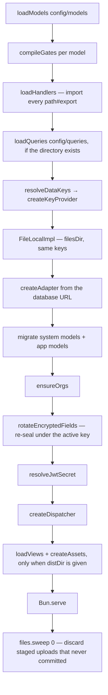

# Configuration and boot

An app is a directory of YAML. Boot reads it, refuses anything it cannot honour, and only then
serves. Nothing in this layer is lazy: a typo in a model file, a hook bound to a point that is never
fired, a query naming a model that does not exist, a view naming a component the UI does not
register — each of those stops the process with a message naming the file, the path and the valid
alternatives. A running server is therefore evidence that its configuration compiled.

## The config directory

```text
apps/showcase/config/
  models/*.yaml        resources — storage, API, gates, schemas, UI facts
  views/*.yaml         routes and component trees
  queries/*.yaml       named joins, filters, groupings, measures
  theme.yaml           design tokens, one document
  icons.yaml           the app's icon vocabulary, one document
  notifications.yaml   delivery providers, one document
  assets/              the app's own images, served by route
  hooks/*.ts           code an x-hooks or x-actions entry references as path#export
```

Three **config families** (models, views, queries), three **single documents**, one directory of
images, and one of ordinary TypeScript. The single documents are not families — they are one file
each, loaded by their own compiler rather than by `loadFamily`, and each is optional: a missing
`theme.yaml` leaves the bundle's own tokens standing. They are documented below. Hooks
are not a family either: `x-hooks` and `x-actions` are model keywords, compiled and consumed as part of a
model's lifecycle, and a `./hooks/note.ts#rejectForbiddenWord` string is a reference resolved by
Bun's module loader rather than a document with a schema.

A family whose directory does not exist is not an error — an app that declares no queries has no
`queries/` — with one exception: `models/` must exist and must produce at least one model, or boot
fails with `no models found`. A directory that *does* exist is loaded, so declaring a query and
misspelling its model is a boot failure, not a 500 later.

## The shared loader

`loadFamily` (`packages/core/src/config/loader.ts:61`) is the only thing that reads a family, and
every family gets the same six steps per document:

1. **Scan** — `new Bun.Glob('*.yaml').scan({ cwd: dir })`. Only `*.yaml`, only that directory, not
   recursive. Filesystem order; a family that needs a stable order sorts the result itself.
2. **Name** — `source` is the last two path segments (`models/note.yaml`). Every message in this
   layer starts `config error in models/note.yaml: …`.
3. **Trap check** — `assertNoYamlTraps` (`config/yaml-traps.ts`) reads the **raw text**, before the
   parse, because parsing is what destroys the evidence. Two shapes that YAML accepts and this
   framework's config hits often:

   | Written | YAML reads | Reported as, without the check |
   |---|---|---|
   | `background: linear-gradient(90deg, #f43f5e 0%, …)` | `linear-gradient(90deg,` — the rest is a comment | **nothing.** The document is valid and the value ships truncated |
   | `- { type: Text, text: One session, two outcomes }` | two keys, the second `two outcomes: null` | `/node/children/0 must NOT have additional properties` |
   | `- Build safely: build smart` | a one-key **mapping**, not a sentence | **nothing.** View props are untyped, so it renders as `{ "Build safely": "build smart" }` on the page |

   All three now fail naming the file, the line, the value and the fix. The rules are written to be
   quiet rather than merely suspicious: a `#` is flagged only when it precedes a hex colour or cuts a
   value mid-bracket, a flow mapping only when it is the whole value and an entry has no colon of
   its own, and a list item only when the key it would form **contains a space** — real keys here are
   identifiers, so `https://…`, `at: 09:30` and a mid-sentence colon all pass — so a trailing comment, a quoted colour, `[name, email]`, `"rgba(255, 255, 255, 0.4)"`
   and `"{name}, your seat is confirmed"` all pass. Across the 55 YAML documents in this repo and
   `deploy/`, the rules report nothing.
4. **Guard** — `assertNoLiteralSecrets` (`secrets.ts:75`) walks the parsed document and refuses any
   string that looks like PEM private-key material or 40+ characters of base64. Config *names*
   secrets; it never carries them (§10).
5. **Preflight** — an optional family hook that runs before the meta-schema, so a family can give a
   better message than a strict schema's `must NOT have additional properties`. Models use it for
   renamed keywords: `x-fields` fails with `"x-fields" has been renamed to "x-field-access"`.
6. **Meta-schema, then compile** — one Ajv instance (`loader.ts:18`, `allErrors: true`), so a
   document reports every schema problem at once, then the family's own compiler turns the validated
   document into a typed runtime value.

`ConfigError` is `config error in <source>: <detail>`. `crossRef` (`loader.ts:83`) is the shared
"that field does not exist" message — it names what was written, the model it was written against,
and every field that does exist.

## `theme.yaml` — design tokens

One document, optional. It declares CSS custom properties, which the launcher renders into a
`:root{…}` rule at **serve** time — so a theme change is a restart, never a rebuild.

```yaml
title: AI Business Stack          # optional, for the reader
colors:
  canvas: "#07080c"               # → --color-canvas
  accentHover: "#ffa557"          # → --color-accent-hover
radius:
  control: 0.5rem                 # → --radius-control
fonts:
  sans: Inter, system-ui, sans-serif   # → --font-sans
tokens:
  heroMaxWidth: 68rem             # → --hero-max-width. The escape hatch, and it is narrow
```

Four groups, each a map of name to value, each with a fixed prefix:

| Group | Becomes | Names the framework's components read |
|---|---|---|
| `colors` | `--color-<name>` | `canvas`, `surface`, `line`, `ink`, `muted`, `accent`, `danger`, `focus` |
| `radius` | `--radius-<name>` | `control`, `surface` |
| `fonts` | `--font-<name>` | `sans`, `mono` |
| `tokens` | `--<name>` | anything else, verbatim |

**A token name is letters and digits, starting with a letter.** `accentHover` becomes
`--color-accent-hover`: config reads naturally, CSS gets its spelling.

**The document is closed** (`additionalProperties: false`), like every meta-schema here — a group
name that is not one of the four is a typo, and a typo that loads silently is a theme that half
applies.

Two refusals worth knowing, both at boot:

- **A value that does not close every `(` it opens** is refused, naming the token. An unclosed
  parenthesis consumes the end of its own rule *and every token declared after it*, so CSS drops
  them all with no error anywhere. It is refused rather than dropped because a theme that half
  applies is the failure being fixed (AUD-080).
- **A value containing an unquoted `#`** is refused by the YAML trap check above — quote every hex
  colour and every gradient.

A token nobody consumes is a declaration pretending to be a feature. When a component stops reading
one, its line comes out of this file (AUD-081).

## `icons.yaml` — the icon vocabulary

One document, optional. It maps a name to **the shapes that draw it**, and the `Icon` component
resolves a `name` prop against it.

```yaml
icons:
  check: M20 6 9 17l-5-5                        # path data, one or more `M` runs
  target: <circle cx="12" cy="12" r="10"/><circle cx="12" cy="12" r="4"/>
```

**An icon is a list of shapes, not necessarily a path.** A circle approximated as path data is a
different drawing. Seven shapes are accepted, each with its own attributes and nothing else:

| Shape | Attributes |
|---|---|
| `path` | `d` |
| `circle` | `cx`, `cy`, `r` |
| `ellipse` | `cx`, `cy`, `rx`, `ry` |
| `rect` | `x`, `y`, `width`, `height`, `rx`, `ry` |
| `line` | `x1`, `y1`, `x2`, `y2` |
| `polyline`, `polygon` | `points` |

Geometry attributes accept numbers and separators; `d` and `points` carry path commands. **Nothing
here can script, fetch or style** — that is why the list is closed rather than passing SVG through.

Refused at boot rather than injected: a value that is neither path data nor a list of shapes fails
with `icons.<name> must be path data or a list of shapes`, and text that claims to be path data but
is not fails naming what was written. The value reaches an SVG attribute, so it is validated before
it gets there, never sanitised after.

## `notifications.yaml` — delivery providers

One document, optional. It declares **where** a notification goes; a model's `x-events` and `notify`
declare **when** and **what** (see [02-models.md](02-models.md#notifications--x-events-and-notify)).

```yaml
providers:
  ops-webhook:
    type: webhook
    url: http://127.0.0.1:47331/hooks/note
    timeoutMs: 5000                      # optional
    secretRef: WEBHOOK_SIGNING_SECRET    # the NAME of an env var. Never the value

  ops-mail:
    type: email
    host: smtp.example.com
    from: ops@example.com
    to: [ops@example.com]                # one or more recipients
    tls: true                            # implicit TLS on connect; port defaults to 465
    user: ops@example.com                # optional
    secretRef: SMTP_PASSWORD             # the NAME. Never the value
```

Two provider types, and the fields are not interchangeable:

| | Required | Optional | Refused |
|---|---|---|---|
| `webhook` | `url` | `timeoutMs`, `secretRef` | `host`, `port`, `tls`, `user`, `from`, `to` |
| `email` | `host`, `from`, `to` | `port`, `tls`, `user`, `secretRef` | `url`, `timeoutMs` |

`timeoutMs` defaults to **5000**; `port` defaults to **465 when `tls: true`**, and 25 otherwise.
Naming a field the other type owns is
a boot error saying so — `provider "ops-mail" is an email provider, so "url" means nothing to it` —
rather than a field silently ignored.

**`secretRef` carries the variable's NAME, never its value.** It resolves through `secret()` at
boot, so `SMTP_PASSWORD_FILE` works exactly as `SMTP_PASSWORD` does; config that carries literal
secret material is refused by the loader's guard (§10, [09-secrets.md](09-secrets.md)).

## `config/assets/` — the app's own images

A directory beside the YAML, for bytes an app owns: a logo, a payment QR, a favicon. Config names
them; the same route that serves the bundle serves them, and the path is resolved against this
directory with a traversal guard — `/assets/../../.env` does not escape it
(see [08-files.md](08-files.md)).

It is not a config family: nothing is parsed, validated or compiled. A missing directory is not an
error.

## Boot order

`createApp` (`packages/core/src/app.ts:135`) runs this before the first request is accepted:



Three things about that order are load-bearing:

- **Every expression compiles at boot.** `compileGates` walks `x-access`, `x-scope` and
  `x-field-access` and compiles each JEXL expression (`gates.ts:29`), so a broken gate fails startup
  rather than a request. The same applies to every expression inside a declarative hook.
- **Every handler resolves at boot.** `loadHandlers` (`handlers/index.ts:101`) imports each
  `path#export` now. A missing file, a missing export, or an export that is not a function is an
  `ExtensionError` naming the model and the lifecycle point. There is no id registry to drift from
  the config.
- **Key rotation is a boot-time data migration.** `rotateEncryptedFields` re-seals rows and files
  under the active key id before serving, because an active key nothing is sealed under means the
  old key cannot be retired and every blind index is stale.

The architecture record (§17) lists "resolve secrets" first. In code `APP_DEK` resolves after
handlers load and `JWT_SECRET` after migrate. The guarantee is the same — nothing serves before both
are known — and the difference is a documentation nit, not a defect.

### What `createApp` takes

| Option | Meaning |
|---|---|
| `configDir` | The directory holding `models/`, `views/`, `queries/` |
| `databaseUrl` | Scheme picks the engine (`sqlite://`, `postgres://`, `mysql://`) |
| `port`, `version` | `version` defaults to `v0` and prefixes every API path |
| `distDir` | Built UI bundle. Omitted ⇒ no views load and no asset route exists |
| `title` | Document title carried in the projection |
| `filesDir` | Uploaded bytes. Defaults to `<cwd>/.data/files` |
| `components` | Component names a view may name. Omitted ⇒ that check is skipped |
| `argon` | Argon2 cost. Lowered for tests and local gates — see project memory |
| `platformAdmins` | Addresses holding the reserved `platform` role; defaults to `PLATFORM_ADMINS` |

`apps/showcase/src/main.ts` is the whole reference entry point: sixteen lines, of which one is the
`createApp` call.

## Secrets

`secret(name)` (`packages/core/src/secrets.ts:30`) is the single seam. For any name, the value comes
from `NAME`, or from the file `NAME_FILE` points at (with one trailing newline stripped) — the
orchestrator convention, so the value never appears in the environment or a process listing.

| Situation | Result |
|---|---|
| Both `NAME` and `NAME_FILE` set | `both NAME and NAME_FILE are set; set exactly one` |
| `NAME_FILE` unreadable | `NAME_FILE points at <path>, which could not be read: <code>` — the source, never the value |
| Missing, or empty, or an empty file | `NAME is not set (provide NAME, or NAME_FILE pointing at a file containing it)` |

Empty is missing, not an empty secret. Resolved values are cached per name, so a secret is read once.

### The two the framework needs

**`APP_DEK`** is data-encryption key id `k1`. Further keys are `APP_DEK_<KID>` (`APP_DEK_K2` is kid
`k2`), and `APP_DEK_ACTIVE` names the one new ciphertext is written under. Each has its own `_FILE`
form. Rotating is: add the key, point `APP_DEK_ACTIVE` at it, restart — boot re-seals every row and
file, and the old key can then be removed.

**`JWT_SECRET`** signs sessions.

Refusals from `resolveDataKeys` / `resolveJwtSecret` (`app.ts:68`, `app.ts:123`):

| Condition | Message |
|---|---|
| `APP_DEK` and `APP_DEK_K1` both set and different | `both APP_DEK and APP_DEK_K1 are set and differ; they are the same key id — set exactly one` |
| `APP_DEK_ACTIVE` names a kid with no material | `APP_DEK_ACTIVE names key id "<kid>", which has no key material (set APP_DEK_<KID>). Known: …` |
| No material for the active kid | `no key material for the active key id "<kid>": set APP_DEK, or name a different one with APP_DEK_ACTIVE. Known: …` |

Outside production (`NODE_ENV !== 'production'`) a missing `APP_DEK` or `JWT_SECRET` boots on an
ephemeral value with a warning that says so: encrypted values do not survive a restart, and every
restart invalidates all sessions. **Production refuses to boot without either.** For local work,
keep real key files — `JWT_SECRET_FILE=.data/jwt.key APP_DEK_FILE=.data/dek.key bun run dev` — and
keep them in `.data/`, not `.tmp/`, which Bun clears.

## Operational environment knobs

`packages/core/src/limits.ts` reads these once at module load, so a bad value fails the boot rather
than a request. They are deployment questions (disk, hardware, how long a request may take), not
model questions, which is why they are environment variables and not a config family.

| Variable | Default | Notes |
|---|---|---|
| `LIST_DEFAULT_LIMIT` / `LIST_MAX_LIMIT` | 25 / 100 | The generic `/v0/list/<model>` surface |
| `QUERY_DEFAULT_LIMIT` / `QUERY_MAX_LIMIT` | 50 / 500 | Declared queries — named, compiled, approved at boot |
| `CSV_PAGE_SIZE` | 500 | The export's internal page size; invisible to the reader |
| `CSV_MAX_ROWS` | unlimited | `0` or `unlimited` means no ceiling; an export streams, so rows cost duration, not memory |
| `UPLOAD_DEFAULT_MAX_SIZE` | `50MB` | Only for a property whose `x-upload.maxSize` says nothing |
| `RATE_LIMIT_WINDOW_SECONDS` | 60 | |
| `RATE_LIMIT_PER_IP` / `RATE_LIMIT_PER_EMAIL` | 10 / 5 | Counts **failures** on login, refresh and invite redemption |
| `RATE_LIMIT_REGISTER_PER_IP` | 30 | Counts every attempt — the threat there is volume, not guessing |
| `PLATFORM_ADMINS` | — | Comma-separated addresses holding the reserved `platform` role (§22.1) |
| `DATABASE_URL` | per app | Resolves through `secret()`, so `DATABASE_URL_FILE` works |

A count that is not a positive integer fails with `<NAME> must be a positive integer (got "…"). It
is a row count, and leaving it unset uses the default of <n>.` `CSV_MAX_ROWS` also accepts `0` and
`unlimited`; `UPLOAD_DEFAULT_MAX_SIZE` must be `digits` followed by `B`, `KB`, `MB` or `GB`.

None of this moves policy: the server still clamps every limit into `[1, max]` and still mints every
cursor. The environment moves the ceiling; it never hands the ceiling to the caller.

## Every boot refusal, by stage

| Stage | Refuses | Where |
|---|---|---|
| Loader | an unquoted `#` truncating a value, a comma splitting a flow mapping, or a colon turning a list item into a mapping | `config/yaml-traps.ts` |
| Loader | literal secret material in any config document | `secrets.ts:79` |
| Loader | a renamed keyword (`x-fields` → `x-field-access`) | `model.ts:268` |
| Loader | a document failing its family meta-schema | `loader.ts:72` |
| Models | every model-compiler refusal — see [02-models.md](02-models.md#every-refusal) | `model.ts` |
| Models | no models at all; a duplicate `$id` | `model.ts:537`, `model.ts:533` |
| Gates | an expression JEXL cannot parse: `<model>.x-access.read: invalid expression "…" — …` | `expressions.ts:160` |
| Gates | an unknown transform: `… uses unknown transform "trimm" — available: trim, collapseWhitespace, lower` | `expressions.ts:164` |
| Handlers | `"<ref>" could not be imported: …`; `has no export "<name>" (exports: …)`; `export "<name>" is not a function` | `handlers/index.ts:77-87` |
| Queries | a document failing the query meta-schema; `duplicate query "<name>"` | `queries/compile.ts:248`, `:539` |
| Views | `<where> names unknown component "<type>" — known: …` | `projection.ts:255` |
| Views | `requires unknown model "<name>" — known: …` | `projection.ts:449` |
| Views | `route "<route>" is already served by <id>` | `projection.ts:455` |
| Views | a tie in `navOrder`; a node with no string `type`; a page with no `id` or `route` | `projection.ts:463`, `:319`, `:380` |
| Keys | the three `APP_DEK` conditions above; a missing secret in production | `app.ts:68`, `secrets.ts:65` |
| Limits | a non-positive-integer count; a malformed `UPLOAD_DEFAULT_MAX_SIZE` | `limits.ts:27`, `:118` |
| Migrate | a destructive schema change not declared in `x-storage.migrations` | `db/migrate.ts` — see [06-persistence.md](06-persistence.md) |

Config compiles at boot and only at boot. **Editing YAML does nothing until the process restarts.**

## How to verify this layer

Boot refusals are the contract, so exercise them the way an author meets them: break one thing and
read the message.

```sh
cp -r apps/showcase/config /tmp/cfg
printf '\nx-nonsense: true\n' >> /tmp/cfg/models/note.yaml
bun -e 'import {loadModels} from "./packages/core/src/model.ts"; await loadModels("/tmp/cfg/models")'
# ConfigError: config error in models/note.yaml: / must NOT have additional properties
```

For the whole boot, run the server the project's way and watch what it prints:

```sh
JWT_SECRET_FILE=.data/jwt.key APP_DEK_FILE=.data/dek.key bun run dev
# showcase listening on http://localhost:3000/
# models: note, unpoliced, customer | tables: _users, _sessions, _orgs, _invites, _audits, notes, unpoliced, customers
curl -s localhost:3000/health          # {"status":"ok","version":"v0"}
```

The model list and the table list in that second line are the compiled config talking. If a model is
missing from it, the file did not load.

## Related

[02-models.md](02-models.md) · [03-derived-schemas.md](03-derived-schemas.md) ·
[09-secrets.md](09-secrets.md) · `ARCHITECTURE.md` §3.1, §10, §17

---

_Checked against the code 2026-09-16_ — `packages/core/src/app.ts`, `config/loader.ts`,
`config/system-fields.ts`, `secrets.ts`, `limits.ts`, `expressions.ts`, `gates.ts`,
`handlers/index.ts`, `model.ts`, `server.ts`, `db/factory.ts`, `projection.ts`,
`queries/compile.ts`, `apps/showcase/src/main.ts`, `apps/showcase/config/`.
