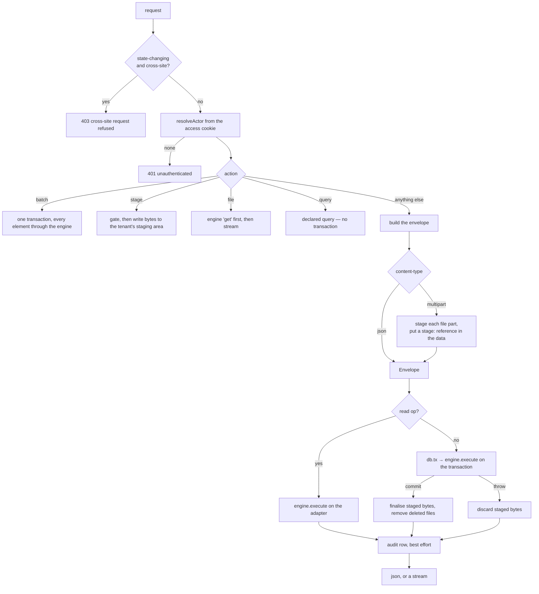

# Dispatch and the pipeline

One route surface serves every model:

```text
/<version>/<action>/<model>/<id?>
```

There is no per-model controller and no per-model route file. `packages/core/src/dispatch.ts` is
fourteen lines of re-export over the two halves that do the work:

- **intake** (`http/intake.ts`) — request to envelope, result to response. Route parsing, the actor,
  the body, the query string, the transaction, staged files, the audit row, the wire mapping of
  errors. **Nothing here decides whether an operation may run.**
- **engine** (`engine/execute.ts`) — the one execution path. Every operation, in a fixed order, with
  the gates at the front of it.

`ctx.call` re-enters the engine rather than reaching past it, so a hook that composes another
operation passes the same gates as the caller who triggered it. There is no privileged internal door.

## One request



## The envelope

Everything inbound is reduced to one value before the engine sees it
(`engine/types.ts`, built in `http/intake.ts:385`):

| Field | From |
|---|---|
| `actor` | `resolveActor` — the session cookie, server-assigned. **Never the request body** |
| `op` | The `<action>` path segment |
| `model` | The `<model>` path segment |
| `id` | The `<id?>` path segment |
| `data` | The JSON body, or the multipart parts, or `{}` for a read |
| `query` | `limit`, `sort`, `dir`, `cursor`, `op`, and every `?where=field:op:value` |
| `meta` | `requestId` (a UUID minted per request), `at`, and `source` |

`meta.source` is `http` for an ordinary request, `batch` for an element of one, `call` for a
`ctx.call`, `file` for the read a download performs before streaming, `event` for work an outbox
delivery performed after some earlier request committed, and `schedule` for work no request asked
for at all. It is what lets the audit
record distinguish a hook's write from the request that triggered it.

**Filters.** `?where=<field>:<op>:<value>`, repeatable. The operator is matched against a framework
enum — `eq`, `ne`, `gt`, `gte`, `lt`, `lte`, `contains`, `in` — and anything else is a 400 naming
the malformed filter. `in` splits the value on commas; `true`, `false` and numeric strings are
coerced. The field is resolved against the model's own `filterable` allowlist inside the adapter, so
a caller's string never becomes SQL text.

## Order of operations, per op

Read line by line from `engine/execute.ts`. Two things happen before the switch, for **every**
operation (`execute.ts:107-121`): the model is resolved, and one declaring `x-dispatch: read` refuses
every write with `read_only_model` — the framework's own models declare it, so they are read through
this surface and written only by the routes that operate them — and then

1. **Phase one** — `allowsAction(model, view)` with **no row loaded**. Deny by default.
2. **Scope** — `resolveScope(model, view)` produces the values bound into every statement below.

| Op | Order |
|---|---|
| `schema` | if an id was given — `/v0/schema/<model>/<id>` — `tx.get` in scope → decrypt → **phase two** → derive for `?op=` (default `create`) with this actor's read/write predicates, and with the row informing the requirement set |
| `create` | validate(`create`) → refuse a lifecycle field → write gate → resolve staged uploads → `beforeCreate` → uniqueness → mint the id → encrypt → `tx.create` → decrypt → `afterCreate` → emit `<model>.created` → read projection |
| `update` | validate(`update`) → refuse a lifecycle field → `tx.get` **in scope** → decrypt → **phase two** → write gate (with the row) → resolve staged uploads → `beforeUpdate` → uniqueness (excluding this row) → encrypt → `tx.update` → decrypt → `afterUpdate` → emit `<model>.updated` → read projection |
| `delete` | `tx.get` in scope → decrypt → **phase two** → `beforeDelete` → `tx.delete` → queue file removals → read projection of the old row → `afterDelete` → emit `<model>.deleted` |
| `get` | `tx.get` in scope → decrypt → **phase two** → read projection |
| `history` | `tx.get` in scope → decrypt → **phase two** → the framework's own records for that row, newest first ([§events](#events-and-the-outbox)) |
| `list` | rewrite encrypted filters to their blind index → `tx.list` → per row: decrypt, then read projection **against that row** |
| `count` | rewrite filters → `tx.count` |
| `aggregate` | require `measures` → refuse encrypted groups and measures → rewrite filters → `tx.aggregate` |
| custom action | if an id was given: `tx.get` in scope → decrypt → **phase two** → validate(`<op>`) **against that row** → write gate → `before<Op>` → the handler → `after<Op>` → emit `<model>.<op>` → read projection unless the result is an array |

Five properties of that table are load-bearing:

- **No persistence read, hook, render or side effect happens before phase one.** The row is not
  known at that point and must not be: fetching it to decide whether the caller may fetch it is the
  inversion §16 forbids.
- **Phase two only narrows.** A caller who failed phase one never reaches it.
- **`list` does not re-check access per row.** Dropping rows after the fact is post-fetch filtering:
  it breaks paging and counts, and leaks through aggregates. Which rows a caller may see is
  `x-scope`'s job, bound into the statement. Field policy *is* per row, because it may depend on the
  row's values.
- **A custom action's array result is not re-projected.** That is what a declared `batch` returns,
  and each element already came back through `ctx.call` with its own model's policy applied.
  Projecting again would judge another model's row by this one's field names.
- **`ctx.call` is depth-capped at 5** (`execute.ts:23`) and carries the same transaction, the same
  staged-file list and the same denied-field list as its caller.
- **A custom action loads its row before validating.** A requirement set may depend on the stored
  row (§5's state axis, [03-derived-schemas.md](03-derived-schemas.md)), and a document that says "a
  customer is required" cannot be derived without knowing whether the row already has one. Phase one
  still runs first and phase two runs the moment the row arrives, before any hook or write; what
  moved is the shape check, which now happens after the `404` rather than before it.

## Transactions, and the bytes beside them

`READ_OPS` — `get`, `list`, `count`, `aggregate`, `schema`, `query` — run against the adapter with
no transaction. Everything else gets **exactly one** (`intake.ts:390`), shared by every element of a
batch and by every `ctx.call` inside it.

Uploaded bytes follow the transaction rather than racing it:

- Multipart parts and `POST /v0/stage/<model>/<property>` both write into the tenant's staging area
  and yield a `stage:<id>` **reference**. A caller may send nothing else — a descriptor sent whole
  would be believed, and its `name`, `size` and `contentType` are what every later download reports.
- On a throw, every staged file is discarded. Only after commit are they finalised and the files
  belonging to deleted rows removed. A rollback leaves the disk untouched.
- Whatever was staged and never claimed is swept at the next boot.

## The other four actions

**`batch`** — `POST /v0/batch` with `{"operations":[…]}`. Every element runs through the engine on
one transaction, so the whole thing commits or none of it does. Verified live: a batch of two
creates returned both rows; a batch whose second element failed validation returned `422` and left
**no** trace of the first (`?where=name:eq:Batch Three` → `[]`).

**`stage`** — `POST /v0/stage/<model>/<property>`, one file part. Writing bytes is a side effect, so
the access gate and the field-write gate both run before the body is read, and the model-level gate
runs before the property is even looked at — which of a model's fields take a file is part of the
shape projected per actor, not public. Returns `{ ref, name, size, contentType }`.

**`file`** — `GET /v0/file/<model>/<id>/<property>` runs the **full read path** first: a real engine
`get`, so access, scope and field-read policy all apply before a byte is streamed. A field the actor
may not read is already absent from the projection, and absent is indistinguishable from "no file".

**`query`** — `GET|POST /v0/query/<name>`, and `/v0/query/<name>.csv` for the same read rendered as
a stream. A read, gated like one. GET carries parameters in the query string; POST carries them in a
body, for a parameter set too large or structured for a URL. The compiler and the gating are in
[06-persistence.md](06-persistence.md).

## The error taxonomy

One classification, in `engine/audit.ts:22`, read by both the response and the audit row so the two
cannot disagree. Every line below was produced against the running showcase:

| Status | Body | Raised by |
|---|---|---|
| 401 | `{"error":"unauthenticated"}` | No actor could be resolved |
| 403 | `{"error":"forbidden","detail":"cross-site request refused"}` | The same-origin check, before anything else |
| 403 | `{"error":"forbidden","detail":"forbidden","meta":{…}}` | Phase one — `Denied` |
| 403 | `…"detail":"forbidden_for_this_row"` | Phase two. The showcase declares no row-dependent `x-access`, so this one is proven by `packages/core/test/two-phase-gate.test.ts` rather than by a live probe |
| 403 | `…"detail":"\"start\" moves note from todo, but this row is doing"` | Phase two again — a declared transition from a state it does not name ([05-gates.md](05-gates.md)). The reason is on the wire because it is a workflow fact about a row this caller may already write |
| 404 | `{"error":"unknown_model"}` | No such model |
| 403 | `…"detail":"read_only_model"` | A write to a model declaring `x-dispatch: read`. The framework's `user`, `org`, `invite`, `session`, `audit`, `outbox` and `schedule` all declare it |
| 404 | `{"error":"unknown_action"}` | Not a builtin and not a declared action |
| 404 | `{"error":"not_found"}` | No row **within this actor's scope** |
| 400 | `{"error":"bad_request","detail":"malformed filter \"title-eq-x\" (expected field:op:value)"}` | Intake |
| 400 | `…"detail":"limit must be a positive integer"` · `"body is not valid JSON"` · `"id required"` · `"measures are required"` | Intake and the engine |
| 422 | `{"error":"validation_failed","errors":[{"path":"/title","keyword":"required",…}]}` | The derived schema |
| 422 | `…[{"path":"/name","keyword":"unique","message":"must be unique"}]` | The uniqueness probe |
| 422 | `…[{"path":"/f","keyword":"write","message":"you may not write this field"}]` | Field policy with `onDenied: reject` |
| 422 | `…[{"path":"/status","keyword":"state","message":"\"status\" changes only through a transition — start, finish, restart"}]` | A write to a model's lifecycle field outside a transition ([02-models.md](02-models.md)) |
| 500 | `{"error":"decryption_failed","requestId":"…"}` | Ciphertext that will not open — loud in the log, a code on the wire |
| 500 | `{"error":"internal_error","requestId":"…"}` | Anything else. The client learns nothing about our internals |

A 404 for another tenant's id is deliberate: a scoped `get` misses, and a miss is not a lie.

## Events and the outbox

A write can mean something has to happen next — a notification, a follow-up
record, a webhook. Doing it in the request means a failure rolls the write back;
doing it after the response means a crash loses it. The **transactional
outbox** is the way out of that choice, and it is one rule:

> The `_outbox` row is written **inside** the transaction that caused it, and
> delivered **after** that transaction commits.

So the fact and the intent to act on it are one write. There is no window in
which the row exists and the event does not, and none in which the event exists
and the row does not.

**Emitting.** `ctx.emit(name, payload)` buffers; the engine drains the buffer at
the end of the outermost operation, onto the caller's transaction handle
(`engine/execute.ts`, `execute`). `ctx.call` re-enters the inner `run`, so a
hook's event joins the caller's buffer rather than opening one of its own, and a
batch element contributes to the shared transaction. Generic dispatch emits
`<model>.created`, `.updated`, `.deleted` and, for a custom action, its own name
— so a declared transition is an event exactly as a create is. An event nothing
is listening for is not written at all ([02-models.md](02-models.md)).

The payload is **ids and names, never row values**: `_outbox` is plain text
beside ciphertext, and the same rule that keeps values out of `_audits.fields`
keeps them out here. A listener that needs the row fetches it at delivery time,
through the gates, which is also how it sees the row as it is now rather than as
it was when nobody was asking.

**Delivering.** `events/outbox.ts` polls `_outbox` on the app's own connection,
started by `createApp`. Reading on another connection is what makes "after
commit" true by construction: a row the worker can see is a row that committed,
and a request that rolled back leaves nothing to find. Nothing in the request
path signals it — `onEmit` asks for an earlier pass and is latency, never
correctness.

Each due row is delivered in **its own transaction**, opened after the causing
one closed. That is why a listener that throws cannot undo the write: the
transaction it would have rolled back is gone. The attempt is counted, audited,
and retried with an exponential backoff (250ms, doubling) until it is delivered
or gives up as `failed` with the reason. **At-least-once** — the only honest
guarantee without a distributed transaction. Rows are delivered independently,
so one bad listener cannot stall the ones behind it.

A chain is capped at five deliveries, like `ctx.call`, because a listener
reacting to its own effect is a loop in a worker nobody is watching. Each row
records its own depth and is failed with the reason rather than dropped.

Live, against the showcase, where `note.finish` pins the note it finished:

```text
POST /v0/finish/note/$ID  {}       -> 200 {"status":"done","pinned":null}   # the listener has not run
GET  /v0/get/note/$ID     (later)  -> 200 {"status":"done","pinned":true}   # it has now
_outbox                            -> note.start:delivered  note.finish:delivered
_audits (source=event)             -> note.finish note ok 200
```

And the two failure cases, which are the evidence that the ordering is real:

```text
POST /v0/batch [finish $ID, an invalid create]
  -> 422, the note is still `doing`, and _outbox is unchanged: 11 rows before, 11 after

POST /v0/start/note/$FLAKY        -> 200 {"status":"doing"}     # the listener throws
  _outbox  -> note.start pending attempts=1 lastError="deliberate delivery failure..."
  the note -> still `doing`; nothing rolled back
  later    -> attempts 1 to 2, and each attempt is an `outcome: error` audit row
```

**One process.** Claiming is "read pending, deliver, mark", which is correct
while exactly one worker runs and would double-deliver if two did. Two means
`SELECT ... FOR UPDATE SKIP LOCKED` per engine — WP-04's adapter work, and this
package's one stated ask of it.

### Notifications

A listener may `notify` instead of calling (`x-events`, [02-models.md](02-models.md)). The provider
is named in `config/notifications.yaml` — **not a config family**, one document like `theme.yaml` —
and its `secretRef` gives that reserved keyword its first consumer ([09-secrets.md](09-secrets.md)).

| Type | Sends | Fails when |
|---|---|---|
| `webhook` | `POST` with the message as JSON, `x-appstack-event`, and `x-appstack-signature: sha256=…` over the exact bytes when a secret resolved | non-2xx, a refused connection, or `timeoutMs` elapses |
| `email` | SMTP: EHLO, `AUTH LOGIN` when a user and secret are declared, MAIL/RCPT/DATA | the relay answers anything but the expected code |

Both **throw** on failure, which is the point of hanging them off events: the outbox counts the
attempt and retries, and a receiver being down never fails somebody's write. Nothing a sender says
in an error contains the credential it just sent.

Live, with the gate's own receiver listening on the port the provider declares:

```text
POST /v0/restart/note/$ID          -> 200, and nothing has been sent yet
receiver                           -> x-appstack-event: note.restart
                                      x-appstack-signature verifies against WEBHOOK_SIGNING_SECRET
                                      {"event":"note.restart","model":"note","rowId":"…",
                                       "data":{"id":"…","reopenedBy":"…"}}
```

## Schedules

`x-schedules` on a model declares recurring work ([02-models.md](02-models.md)). `_schedule` holds
one row per (org, schedule) saying when it is next due; **one ticker** serves every declaration,
on the background connection, and runs each due row's operation through the engine as an actor
carrying the declared roles — so `source: schedule` work passes the same gates as a person's.

**The missed-run policy, and it is a decision rather than an accident:**

> A due time that passed while nothing was running **fires once, late, and never backfills.**

A missed run usually means work is undone and the work still needs doing, so skipping silently is the
worse failure. But firing once per missed interval turns an outage into an amplifier — a five-minute
job down for a day would wake owing 288 runs and spend the recovery hammering the database it just
got back. So `nextRunAt` is computed from **now**, not from the slot that was missed, and any backlog
collapses into exactly one run. A late run is counted in `_schedule.lateRuns`, so "did we miss any"
is a column rather than an archaeology exercise.

What that costs, plainly: a schedule meant for a particular time of day fires at the wrong time of
day after downtime. That is the price of interval scheduling, and it is why wall-clock cron is not
built here rather than half-built.

Two more choices worth knowing:

- **Declaring a schedule does not fire it.** First sight sets the due time one interval out, so a
  server that restarts often does not run every schedule on every boot.
- **A quiet run is not audited.** A five-second sweep over a quiet database would otherwise write a
  row every five seconds saying nothing happened. That the ticker is alive is `_schedule.lastRunAt`'s
  job; `_audits` records runs that touched something, or ran late.

```text
_schedule   note.sweep-todo  every 5s  runs=69  lastCount=1  nextRunAt=…
_audits     schedule:sweep-todo  note  ok  200  "1 row(s)"  actor=schedule:note.sweep-todo
```

## Background work has its own connection

The outbox worker and the scheduler run off timers, so they are genuinely concurrent with request
handling — and a driver's transaction state is **per connection**. Sharing one with the request path
meant a worker opening a transaction while a request opened one produced `cannot start a transaction
within a transaction`, and the **request** was what returned 500. Found by a full gate run on
2026-09-18, the day the scheduler started ticking.

`createApp` therefore opens a second adapter for background work. What remains is ordinary database
contention, which both workers treat as **not a result**: a locked or busy database leaves the
outbox row's attempt count and the schedule's due time exactly as they were, so a moment's contention
never consumes a retry or skips a sweep. The lasting fix is a busy timeout on the connection, which
belongs to `db/**`.

## The audit record

One row in `_audits` per request, written **after** the transaction has settled, so a rollback or a
denial still leaves a trace (`engine/audit.ts:55`). Best-effort by design: a failure to write is
logged and swallowed, because the record must never turn a successful request into a failed one.

It carries `orgId`, `requestId`, `source`, `actorId`, `actorRoles`, `op`, `model`, `rowId`,
`fields`, `outcome`, `status`, `detail`, `at`. **`fields` is names only** — a value there would undo
field encryption one row away from the ciphertext.

**A delivery is audited too**, one row per attempt, carrying `source: event`, the event name as
`op`, and the **requestId of the request that caused it** — so a retry is visible rather than silent,
and an event joins to its origin. A failed attempt is recorded with `outcome: error` and
`detail: "attempt <n> failed: ..."`: a counted, retryable failure, not an unhandled fault.

**Successful reads are not recorded.** That would make every list a write, and a read is already
constrained by scope. A *refused* read is recorded, because a denial is the signal worth keeping.

Rows observed in `_audits` after driving the probes above:

```text
source  op                   model            outcome    status  detail
http    create               note             ok         201     denied fields: adminOnlyNote
http    query:cross-tenant   notesAcrossOrgs  denied     403     forbidden
http    get                  note             not_found  404
batch   create               customer         ok         200     rolled back
batch   create               customer         invalid    422
http    batch                -                invalid    422
```

Four things that shows:

- **A trimmed write says so.** The field the gate dropped is in the response's `meta.denied` and in
  the audit row's `detail`, rather than being left for the caller to infer from a 201.
- **A batch is one row per element plus its own.** The element carries `source: batch` and its own
  model; the batch carries `source: http` and `model: '-'`.
- **An element that ran and was then rolled back is recorded as attempted**, with
  `detail: "rolled back"` — it does not claim a write that no longer exists.
- **A cross-tenant read is its own operation.** `op` becomes `query:cross-tenant` on the *attempt*,
  so a tenant actor's refused attempt is as visible as a platform actor's successful one.

## Limits worth knowing

- **A plain `create` audits with `rowId: null`.** The id is minted inside the engine and the intake
  never reads it back, so only a batch element records which row it wrote. Filed in
  `docs/plans/PRODUCTION-BACKLOG.md`.
- **`fields` on an `aggregate` records the body's top-level keys** (`groupBy,measures`), not model
  fields, because it is `Object.keys(envelope.data)` and an aggregate's body is a spec.
- **The client address is the socket's.** Behind a proxy that is the proxy, which is the honest
  answer until a trusted-proxy configuration exists; it is deliberately not `X-Forwarded-For`, which
  a caller controls.

## How to verify this layer

Drive each op and read the record it leaves:

```sh
curl -s -b c.txt -X POST localhost:3000/v0/create/note -H 'content-type: application/json' -d '{"title":"x"}'
curl -s -b c.txt 'localhost:3000/v0/list/note?limit=2&sort=createdAt&dir=desc'
curl -s -b c.txt -X POST localhost:3000/v0/pin/note/<id> -H 'content-type: application/json' -d '{"reason":"because"}'

bun -e 'import {Database} from "bun:sqlite";
  const db = new Database(".data/showcase.sqlite", {readonly:true});
  console.log(db.query("select source,op,model,outcome,status,detail from _audits order by at desc limit 10").all())'
```

The gate feature `scripts/gate/features/` drives the same surface through a browser.

## Related

[05-gates.md](05-gates.md) · [02-models.md](02-models.md) ·
[06-persistence.md](06-persistence.md) · [08-files.md](08-files.md) ·
`ARCHITECTURE.md` §3, §6, §9, §14, §16

---

_Checked against the code 2026-09-16_ — `packages/core/src/dispatch.ts`, `http/intake.ts`,
`engine/execute.ts`, `engine/audit.ts`, `engine/types.ts`, `errors.ts`, `gates.ts`, `server.ts`,
`db/sql.ts`, `db/adapter.ts`. Every status, body and audit row quoted above was produced against
`bun run dev` on port 3000.
