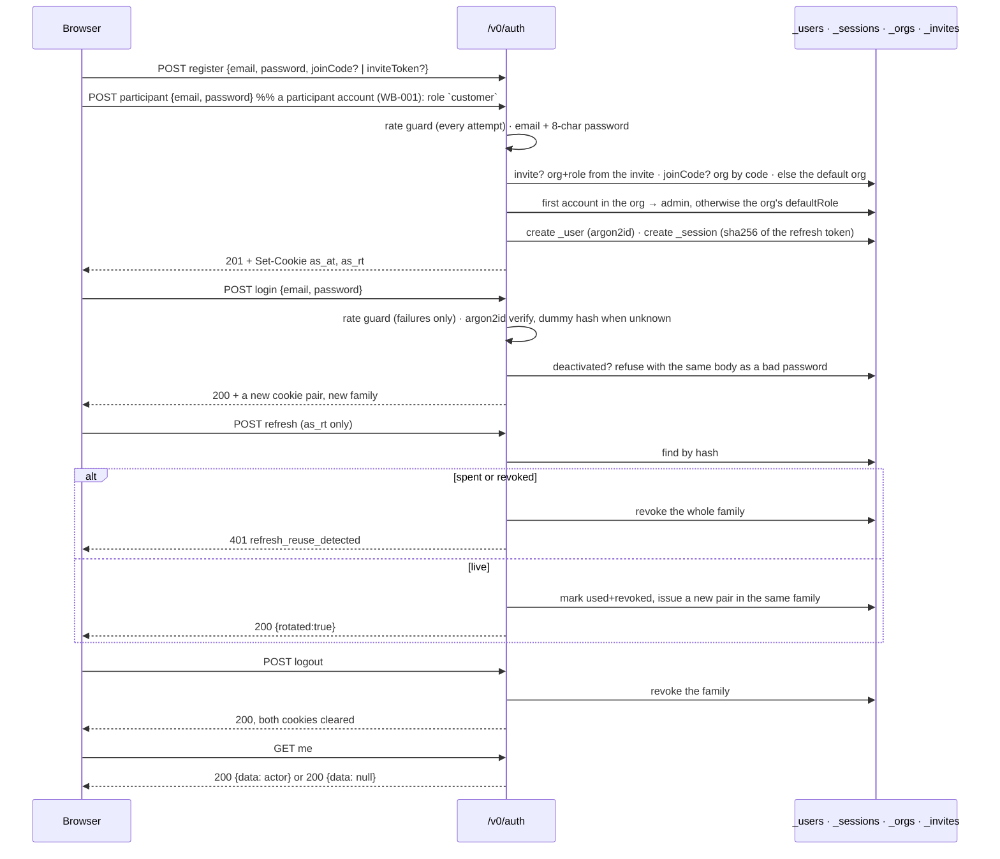

# Auth and sessions

Identity is **server-assigned**. `orgId` and `roles` never come from a request — not from a body, not
from a header, not from a token the caller chose the contents of. Everything in this document exists
to make that true and to keep it true after the fact.

Tokens are **cookies, not headers**. The UI is same-origin, so the access token is unreachable from
JavaScript; there is no token in `localStorage` for a script injection to read.

## The two cookies

```text
as_at   the access token   JWT, HS256      HttpOnly Secure SameSite=Lax    Path=/                  Max-Age=900
as_rt   the refresh token  256-bit opaque  HttpOnly Secure SameSite=Strict Path=/v0/auth/refresh   Max-Age=2592000
```

Both flags are exactly what a `set-cookie` header off a live login shows.

**Why the access cookie is `Path=/` and not `/v0`.** The document at `/` carries this actor's
projection (§19), and a cookie scoped to `/v0` is never sent with that request — so the server could
not tell who was asking for the page it was about to personalise. The narrow path that matters is
the *refresh* cookie's: that one is the long-lived credential, and it still travels only to
`/v0/auth/refresh`. The cost is that the access token accompanies static asset requests too; it
stays HttpOnly, Secure and same-origin, so this widens where it appears in request logs, not who can
read it (decision 27).

The refresh token is **stored hashed** — SHA-256, not Argon2, because 256 bits of entropy needs no
stretching — so a database read yields nothing that can be presented.

## The flows



`GET /v0/auth/me` answers `200 {"data":null}` for an anonymous caller rather than 401. It is a
session probe, not a protected resource, and "nobody" is a valid answer — returning 401 made every
anonymous page load print a console error, which would mask real ones.

## Registration decides the org and the role

Three ways in, and the request never picks:

| Presented | Org | Role |
|---|---|---|
| `inviteToken` | The org the invite names | The role the inviting admin chose |
| `joinCode` | The org holding that code | Founder rule, then the org's `defaultRole` |
| Neither | The default org | Founder rule, then the org's `defaultRole` |

The **founder rule**: the first account in an org founds it and gets `admin`; everyone after holds
the code, which is authorisation to be a member and not to run the place.

Live, sending `"orgId":"HACK","roles":["platform"]` with a registration:

```json
{"data":{"id":"ebab1934-…","email":"probe-4871@example.com",
         "orgId":"b7456169-…","roles":"staff"}}
```

The claimed org and the claimed role are both simply absent from the outcome (AUD-001).

**Present-but-blank is refused, not treated as absent.** `joinCode: ""` used to fall through to the
default org, which is silent mis-tenanting — and an empty string is exactly what an untouched or
truncated form field sends. The key being present means the caller meant to join a particular org:

```text
400 {"error":"invalid_join_code","detail":"\"joinCode\" was sent empty; omit it to join the default org"}
```

A wrong code is `400 invalid_join_code`, never a silent fall back: landing in the wrong tenant must
not be something a typo can do. An invite that is unknown, spent, expired, or issued to a different
address is one answer — `400 invalid_invite` — because an invite token is a bearer credential and
distinguishing the cases tells a holder which guess was warm. It is marked spent only **after** the
account exists, so a failed creation does not burn it.

## Login is enumeration-safe

An unknown address is verified against a **dummy Argon2 hash**, so the work and the response are
comparable either way, and both answer `401 invalid_credentials` — confirmed live for a wrong
password and for an address that does not exist.

A deactivated member's row still verifies: it is a tombstone, not a deletion, because deleting it
would orphan every `_audits.actorId` that names them. The refusal is separate, and gives the same
body — whether an address is deactivated or simply wrong is not a caller's business.

## Refresh: one-time, rotating, family-tracked

Live, in order:

```text
POST /v0/auth/refresh                 200 {"data":{"rotated":true}}
POST /v0/auth/refresh (the spent one) 401 {"error":"refresh_reuse_detected","detail":"session family revoked"}
POST /v0/auth/refresh (the NEW one)   401 {"error":"refresh_reuse_detected","detail":"session family revoked"}
```

The third line is the point. Presenting a spent token means either the user replayed it or somebody
else has a copy, and there is no way to tell which — so the whole **family** is revoked, including
the token that legitimately replaced it. A stolen refresh token buys one rotation and then burns the
session for everyone.

## Revocation that actually revokes

An access token is self-contained and good for its full lifetime, so revoking refresh families alone
is not enough. Believing otherwise was a real bug: a demoted admin kept administering — including
re-promoting themselves — until their token expired. Caught 2026-09-14 by probing exactly that.

The `ver` claim closes it. Every credential-affecting change bumps `_user.tokenVersion`, and
`resolveActorFromRequest` checks the claim against the row:

```text
member lists notes with a fresh token          HTTP 200
admin changes their role                       HTTP 200
the SAME unexpired access token, immediately   HTTP 401
admin deactivates them                         HTTP 200
they try to log in                             HTTP 401 invalid_credentials
```

The cost is one `_user` read per authenticated request. It is a primary-key lookup on a table the
request is already talking to; if it ever matters, the fix is a short-TTL cache keyed by
`(sub, ver)`, not dropping the check.

## The access token

```json
{"alg":"HS256","typ":"JWT","kid":"k1"}
{"sub":"<userId>","org":"<orgId>","roles":["admin"],"ver":0,"iat":…,"exp":…}
```

`verifyJwt` (`auth/jwt.ts:42`) does four things **in this order**:

1. **Pin the algorithm.** `alg` is compared to `HS256` and never read from the token — trusting it
   is the alg-confusion class.
2. **Resolve `kid` from an allowlist.** It selects a key; it never supplies one.
3. **Verify the signature**, over the raw header and payload.
4. **Only then parse the claims** — `exp`, `nbf` and `iat`, each with 60 seconds of skew.

`nbf` is checked even though nothing this server signs carries one, which is exactly why: an
unchecked claim is one an attacker gets to choose the meaning of, and a token minted for later must
not work now. `iat` in the future is treated as malformed.

An org may narrow the access-token lifetime (`accessTtlSeconds`), read at **issuance** — a token
already minted carries its own `exp` and is unaffected. It is clamped to `[60, 3600]` on the way in
*and* on the way out, so a value written before the bounds existed, or straight into the database,
cannot become an eight-hour session:

```text
POST /v0/auth/orgs/<id>/settings {"accessTtlSeconds":99999}
400 {"error":"invalid_settings","detail":"accessTtlSeconds must be an integer between 60 and 3600, or null"}
```

## Roles, and the one that is reserved

`admin` and `staff` are **assignable** — a registration path may grant them. `platform` is
**reserved**, because it is the one role that reads across tenants (§22.1). Two rules keep it out of
reach, and the second is the one that matters:

1. No request-reachable path may assign it. `assertAssignable` is the single refusal, so a future
   path that writes roles inherits it instead of repeating it.
2. **Storage is not a source for it.** `storedRoles` strips every reserved name off a row on the way
   out, so a `roles` column containing `platform` — written by a defect, a migration, a direct SQL
   session or a restored backup — grants nothing.

The claim comes from server configuration alone: `PLATFORM_ADMINS` names the accounts, evaluated at
**every** issuance, so removing an address revokes the claim at the next refresh rather than whenever
a row is next written.

## Administration

Hand-routed under `/v0/auth/`, deliberately not generic dispatch: these are not tenant-scoped models
and must not be reachable through the one route surface. Every route re-derives the actor from the
access cookie and decides for itself.

| Route | Who | Live |
|---|---|---|
| `POST /orgs` | Platform only — **except on an empty instance**, which has no platform actor and no admin, and something has to make the first tenant | Tenant admin → `403 forbidden` |
| `GET /orgs/<id>` | The org's own admin, or platform | `{"name":"Default","displayName":…,"defaultRole":"staff","accessTtlSeconds":null,"isDefault":true}` — **never the join code** |
| `POST /orgs/<id>/settings` | Same | `displayName`, `defaultRole`, `accessTtlSeconds` |
| `POST /orgs/<id>/rotate-join-code` | Same | Returns the new code, shown once |
| `POST /invite` | Org admin | `{"email":…,"roles":"staff","token":"qMfSy…","expiresInSeconds":604800}`. Staff → `403` |
| `GET /members` | Org admin | Members with roles and `deactivated` |
| `POST /members/<id>/role` | Org admin | Bumps `tokenVersion`; refuses `last_admin` |
| `POST /members/<id>/deactivate` | Org admin | Refuses `cannot_deactivate_self` (409) and `last_admin` |

A join code is a 24-byte secret shown **once**, on creation or rotation. No read route returns it —
a settings page that did would be a place to harvest one. Invite tokens are stored hashed for the
same reason.

`cannot_deactivate_self` is not paternalism: an admin who locks themselves out of the only admin
account leaves an org nobody can administer. Live: `409 {"error":"cannot_deactivate_self","detail":"another admin must do this"}`.

## Public pages are the exception; everything else is an access-managed surface

An app that is not entirely public needs **two** things modelled, and it is easy to build only one.

The one that gets built is the **domain object** — the submission, the registration, the order —
with `x-access` on it and a role in the gate. That is real security and it is not enough on its own.
The one that gets skipped is the **administration of identity**: who may join, what they may be,
who can change that, and who can see the list. Without it an app has authentication and no way to
operate it. Adding a colleague means a database write; removing someone who left means another;
neither leaves an audit trail, and nobody can answer "who has admin?" from inside the product.

**This layer already exists — an app adopts it, it does not build it.** Five system models ship with
the framework (`packages/core/src/auth/system-models.ts`): `_users`, `_sessions`, `_orgs`,
`_invites`, `_audits`. The routes above operate them. `MembersScreen` and `OrgScreen` draw them.

So, as a rule:

- **A public page or API** — a landing page, a marketing route, an open sign-up — needs none of this.
- **Anything beyond that** declares its domain model *and* reaches the identity layer: an admin view
  carrying `MembersScreen` and `OrgScreen`, invites rather than hand-made accounts, roles assigned
  through `POST /members/<id>/role` rather than written into a seed.
- **Roles and policy live in config; accounts never do.** `'admin' in actor.roles` is the app's own
  vocabulary and belongs in YAML. A named account does not — see
  [09-secrets.md](09-secrets.md#what-config-may-carry-and-what-it-may-not).

**The shape of getting this wrong** is an app with one domain model, a working sign-in, and no
members screen: correct on the request path, unoperable on the administration path. It passes every
test you would think to write, because the thing missing is not a behaviour — it is a surface.

## Every answer these routes give

| Code | Status | When |
|---|---|---|
| `invalid_registration` | 400 | No email, or a password under 8 characters |
| `email_taken` | 409 | The address already has an account |
| `invalid_join_code` | 400 | Blank, or no org holds it |
| `invalid_invite` | 400 | Unknown, spent, expired, or issued to another address — one answer for all four |
| `invalid_credentials` | 401 | Wrong password, unknown address, or a deactivated account — one answer for all three |
| `no_refresh_token` | 401 | No `as_rt` cookie was presented |
| `invalid_refresh_token` | 401 | No session matches its hash, or the user it names is gone |
| `refresh_expired` | 401 | The session is past `expiresAt` |
| `refresh_reuse_detected` | 401 | The token was already spent or revoked — **and the whole family is now revoked** |
| `rate_limited` | 429 | With `Retry-After` in seconds |
| `unauthenticated` | 401 | An administration route with no actor |
| `forbidden` | 403 | An administration route the actor may not use |
| `not_found` | 404 | The org or member does not exist |
| `invalid_org` | 400 | `POST /orgs` with no name |
| `org_name_taken` | 409 | Another org already has that name |
| `invalid_settings` | 400 | An empty `displayName`, an unassignable `defaultRole`, an out-of-range TTL, or nothing to change |
| `invalid_role` | 400 | A role outside `admin`, `staff` |
| `last_admin` | 409 | The change would leave the org with no active admin |
| `cannot_deactivate_self` | 409 | Another admin must do it |

## Rate limiting

A token bucket per key, in process, on the credential routes. **Failures are what is counted** on
`login`, `refresh` and invite redemption — the threat there is guessing, and a guess that succeeds
is not a guess. `register` counts every attempt instead, because there the threat is the volume of
accounts created.

Live, six wrong passwords for one address:

```text
attempt 1–5  401 invalid_credentials
attempt 6    429 {"error":"rate_limited","detail":"too many attempts; try again shortly"}   retry-after: 60
```

— and the *correct* password is refused too while the window holds, which is the point. Defaults:
10 per IP, 5 per email, 30 registrations per IP, 60-second window
([01-configuration-and-boot.md](01-configuration-and-boot.md)).

The bucket map is capped at 10,000 entries. An unbounded map keyed by client address is a
memory-exhaustion primitive handed to exactly the caller the limiter exists to stop; eviction drops
expired buckets first and then the oldest, and dropping a bucket only ever **forgives**, so the
failure mode is a briefly lenient limiter rather than a server that falls over.

## The chain to scope

This is what the whole document is for:

```text
cookie as_at → verifyJwt (alg pinned, kid allowlisted, signature, then claims)
             → _user row: exists? not deactivated? tokenVersion === ver?
             → Actor { id, roles, orgId }
             → GateView.actor (frozen)
             → x-scope: { orgId: actor.orgId } evaluated to a VALUE
             → bound into every statement by the adapter
             → #assertScoped refuses if the map is empty
```

Every link is server-side, and the only input is a signed cookie the browser cannot read. That is
why `x-scope: { orgId: actor.orgId }` is a tenancy boundary rather than a suggestion, and why the
adapter can refuse an unscoped query outright instead of hoping callers remember
([05-gates.md](05-gates.md), [06-persistence.md](06-persistence.md)).

Which scope key *means* tenancy is **recognised, not declared** (`tenancy.ts`). There is no
`x-tenant:` keyword, because which org a row belongs to is data, not structure. A key is the tenant
key when its expression is a bare read of `actor.orgId` — through JEXL's own parser, so
`actor["orgId"]` classifies identically to `actor.orgId`. A key that *computes* over it
(`actor.orgId + '-shard'`) is neither safely widened nor safely left alone, and a cross-tenant query
naming such a model is refused at boot.

## Limits worth knowing

- **No password change or reset route.** Neither exists yet.
- **The limiter is in-process.** `_ratelimit` rows would be needed only if several server processes
  had to share a budget, and nothing here runs more than one.
- **The client address is the socket's**, deliberately not `X-Forwarded-For`, which a caller
  controls. Behind a proxy the limiter therefore sees the proxy.
- **API keys are deferred by decision** — a second authentication path needs its own threat model
  (WP-05 P-121).

## How to verify this layer

```sh
curl -s -i -c a.txt -X POST localhost:3000/v0/auth/login \
  -H 'content-type: application/json' \
  -d '{"email":"admin@example.com","password":"correct-horse-battery"}' | grep -i set-cookie
# both flags, both paths, both max-ages

cp a.txt stolen.txt
curl -s -b a.txt -c a.txt -X POST localhost:3000/v0/auth/refresh   # {"rotated":true}
curl -s -b stolen.txt      -X POST localhost:3000/v0/auth/refresh   # refresh_reuse_detected
curl -s -b a.txt           -X POST localhost:3000/v0/auth/refresh   # …and so is the new one
```

`scripts/gate/features/` drives sign-in, the session probe and the cross-tenant features through a
real browser; `packages/core/test/jwt.test.ts`, `auth-hardening.test.ts`, `auth-admin.test.ts` and
`platform-role.test.ts` cover the verification order, reuse detection and the role rules. The route
and error-code tables above have their own gate:

```sh
bun docs/stack/checks/auth-routes.ts
# 13 routes, 18 error codes, 0 missing from the document.
```

## Related

[05-gates.md](05-gates.md) · [09-secrets.md](09-secrets.md) ·
[06-persistence.md](06-persistence.md) · [11-projection-and-frontend.md](11-projection-and-frontend.md) ·
`ARCHITECTURE.md` §15, §22, §22.1

---

_Checked against the code 2026-09-16_ — `packages/core/src/auth/index.ts`, `auth/jwt.ts`,
`auth/admin.ts`, `auth/roles.ts`, `auth/rate-limit.ts`, `auth/system-models.ts`, `tenancy.ts`,
`limits.ts`. Every header, status and body above was produced against `bun run dev` on port 3000.
