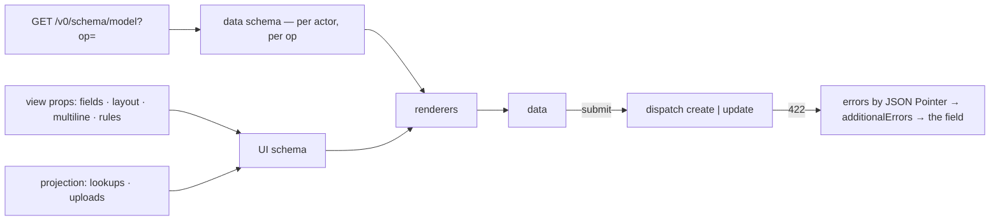

# Forms

A form is not written. It is **derived**: the data schema comes from the server per actor and per
operation, the UI schema comes from view config, and JSONForms puts the two together.



Nothing in that picture interprets a rule the server did not already apply, and nothing in it is a
second copy of the model.

## The data schema

`FormScreen` fetches `GET /v0/schema/<model>?op=<op>` — `update` when it was given an `id`, else
`create` ([03-derived-schemas.md](03-derived-schemas.md)). That single document supplies the types,
the `enum`s, the `format`s, `required`, and `readOnly`. A field this actor may not read is not in it,
so the form cannot render it; a field they may not write arrives `readOnly: true`.

An edit prefills by `get`ting the row and dropping nulls, so an empty column does not become the
string `"null"` in an input.

## The UI schema

Built from the node's props, in `FormScreen.vue`:

| Prop | Effect |
|---|---|
| `fields` | Which fields to show, in order. The data schema still validates everything |
| `layout` | Sections: `{ row: [a, b] }` side by side, `{ group: Name, fields: [...] }` a labelled fieldset, `{ field: x }` full width. Wins over `fields` when both are given |
| `multiline` | Renders as a textarea — `options.multi` on the control |
| `rules` | Conditional behaviour, below |
| `op`, `id`, `submitLabel`, `title`, `doneHref` | The operation, the record, and where to go after |

Two things are attached from the **projection**, not from view config: `options.lookup` for a
relation field (so the control knows which model to fetch options from) and `options.upload` for a
`format: binary` field (`{ model, property, accept, maxSize }`). Both are already filtered per actor
— lookups only to targets they may read, uploads only for properties they may write.

Every field name a form names is checked at **boot** against the model
(`projection.ts`, `assertKnownFields`), including both fields a rule mentions. A typo used to boot
clean and silently render nothing; a rule left naming a renamed field booted clean and simply never
fired (AUD-054).

## Conditional behaviour

```yaml
rules:
  - field: reason
    effect: SHOW          # SHOW · HIDE · ENABLE · DISABLE
    when: { field: status, equals: done }
```

`when` takes `equals`, `oneOf`, or `exists`. The condition is translated into the `rule` JSONForms
already evaluates — a scope pointing at the watched field plus a JSON Schema fragment its value must
satisfy — so **no second expression dialect enters view config** and nothing here interprets a
condition itself.

Three details that were each a defect first:

- **A rule's verdict is honoured.** JSONForms computes `visible` and every renderer here used to
  discard it, so a declared rule produced a condition that was evaluated and thrown away — the field
  never hid. Each control now gates its root on `f.visible` (AUD-051).
- **What is not on screen is not submitted.** The submit filters hidden fields out of the payload;
  before that, an invisible field kept writing (AUD-054).
- **Neither is what this actor may not write.** A `readOnly` property in the derived schema is the
  server's own statement that the field is not part of a write — a field policy denied it, or it
  belongs to a lifecycle and moves only through a transition ([02-models.md](02-models.md)) — so the
  submit leaves it out. Sending it earns a silent drop at best and a `422` at worst, for a value the
  user was never offered a way to change.
- **One rule per control.** JSONForms allows a single `rule` per element, so several rules on one
  field combine with AND — and visibility plus enablement on the same field is refused with a
  message saying to express one of them as the field's own condition, rather than letting two rules
  fight over one control.

## The renderers

Fifteen entries, ranked (`forms/controls.ts:67`). Higher rank wins:

| Rank | Tester | Renderer |
|---|---|---|
| 1 | string | `StringControl` |
| 2 | multiline · boolean · number · integer | `TextareaControl` · `BooleanControl` · `NumberControl` |
| 3 | enum · date · time · date-time · range | `EnumControl` · `TemporalControl` · `NumberControl` |
| 3 | `format` ∈ email, password, phone, tel, uri, url | `TextFormatControl` |
| 5 | `options.lookup` present | `LookupControl` |
| 5 | `format: binary` | `FileControl` |
| 1 | `VerticalLayout` · `HorizontalLayout` · `Group` · `Categorization` | the four layout renderers |

`LookupControl` outranks every plain-string control because a lookup field holds an id, and a text
box for an id is not a form control. It fetches its options through the same `dispatch`, so the
target model's gates and scope apply there too.

### Both pickers are comboboxes

`EnumControl` and `LookupControl` render the same `Combobox.vue` — an input, a listbox, and ARIA
1.2's combobox pattern with `aria-autocomplete="list"`, so focus stays in the text box and
`aria-activedescendant` names the highlighted option. Neither is a `<select>`, and the reason is
different for each:

| | Where options come from | Why |
|---|---|---|
| `EnumControl` | The derived schema's `enum`, filtered **client-side** | The set is closed and already in hand; there is nothing to ask the server. Opening with no query lists everything, so three values behave like the dropdown this replaced — click, see the list, pick |
| `LookupControl` | The server, **one search per keystroke** — `where=<label>:contains:`, debounced, newest response wins | The picker is server-bounded on purpose (decision 40), so it can never hold "all of them". A `<select>` had nowhere to type and therefore no way to reach past one page |

`Combobox.vue` owns the input, the keyboard and the ARIA and owns **no** opinion about where options
come from: it emits `search`, and the caller decides. That split is what lets one component serve a
three-value enum and a ten-thousand-row relation without either case paying for the other.

**The relation's label is fetched by id, separately from the search.** `x-lookup.label` names one
column of the target (defaulting to `id`), and a record may point at a row no search happened to
return — so opening an edit resolves the committed id on its own, once. Without that, a record whose
target sits past the first page renders an empty box while holding a perfectly good value. That was
the half of AUD-066 that raising the limit would not have fixed.

Where the target's config does not admit the search — `x-query.filterable` is an author-declared
allowlist and nothing obliges it to contain the label — the control retries the listing without the
sort, falls back to filtering the rows it already has, and says so under the field rather than
disabling itself. Both couplings are in `PRODUCTION-BACKLOG.md`; the honest fix is a boot check.

The set is deliberately small: only the controls the shipped models actually use. Pre-building a
speculative library is how the previous attempt produced 41 components and a blank page.

**Owning the renderers is the design.** No renderer pack is installed on purpose — writing a
renderer is how a form behaviour is held to the token layer, and line count is not how to judge it.

### The trap every tester has to know

A JSONForms Vue tester — and `props.schema` inside a control — is handed the **root** schema, not
the field's. Testing `schema.format` directly always sees `undefined`, and the field silently falls
back to a text box. `hasTextFormat` and `isUpload` therefore resolve the subschema through
`schemaMatches`, and `EnumControl` reads `control.value.schema.enum`, not `props.schema.enum`.

That last one was AUD-055: every enum control offered nothing at all — a bare `—` placeholder in the
`<select>` it was then — and it had survived since `d752930` because the board's lanes come from
`fetchSchema` instead and the browser gate never picked an enum through a form.

### Keying layouts

The four layout renderers key their children by **`child.scope`**, not by index. JSONForms assigns a
control's id at mount and re-creates it only when its `schema` prop changes; keyed by index, a wizard
swapping step UI schemas makes Vue reuse the control instances — the labels re-render, the `id`,
`data-field` and the label's `for` do not, and a label ends up naming one field while addressing
another. The damage is the label→control association and every field selector, including the gate's
(AUD-056).

## `useField`

Every control shares one wiring function (`forms/field.ts`), which is why they behave identically:

| Exposed | From |
|---|---|
| `id` | `control.id + '-input'` |
| `label`, `required`, `error` | JSONForms' resolved control |
| `readOnly` | schema `readOnly === true` **or** `enabled === false` |
| `description` | the property's JSON Schema `description` — the helper line **under** the control |
| `placeholder` | the property's JSON Schema `examples[0]` |
| `describedBy` | the description and error element ids, for `aria-describedby` |
| `visible` | the rule's verdict (above) |
| `value`, `update` | `control.data`, `handleChange(path, next)` |
| `control` | the raw control, for the subschema a renderer needs |

Two standard keywords, two jobs, neither invented here. A **placeholder is a sample value** —
`e.g. 0917 123 4567 or +63 917 123 4567` — which is what `examples` means; a **description is prose
about the field**, which belongs under it, because a placeholder disappears on the first keystroke,
exactly when a reader who needed the explanation is using it. Both are already carried through
schema derivation ([03-derived-schemas.md](03-derived-schemas.md)), so a field explains itself from
the **model** and no view repeats the copy.

`describedBy` names both elements rather than one: naming only the error is how the description
becomes decoration a screen reader never reaches.

## Files

A `format: binary` property renders as `FileControl`, which uploads **when the file is chosen** —
`POST /v0/stage/<model>/<property>` — and puts the returned `stage:<id>` reference into the form data.
So the submit is an ordinary JSON `create` or `update` whether or not the record has a file.

That is a change worth knowing about: the submit used to switch to multipart when a file was
present, and it posted `create` unconditionally, so saving an **edit** with an attachment tried to
write a second row (AUD-058). One request shape removed the branch and the bug together.

An existing attachment reads back as the stored descriptor, so the control shows the file's name and
size rather than an empty picker.

## Server errors land on fields

Ajv reports `instancePath` as a JSON Pointer and JSONForms addresses controls by JSON Pointer, so
there is **no mapping layer**: a 422's `errors` become `additionalErrors` verbatim and appear on the
fields that caused them. A uniqueness rejection from the server lands on the field, the same as a
client-side `minLength`.

Validation is `ValidateAndHide` until the first submit, then `ValidateAndShow` — so a form does not
shout at a user about fields they have not reached yet.

After a successful write, `announceChange(model)` fires a window event and sibling screens reload.
An edit keeps what was just saved and navigates to `doneHref` if one is set; a create clears for the
next one.

## Limits worth knowing

- **One rule per control**, as above.
- **No array or object fields.** The model layer admits four scalar types, so no form control needs
  to exist for them ([02-models.md](02-models.md)).
- **Client validation is a convenience.** The server re-derives the same schema and validates again;
  a form that got it wrong produces a 422, not a bad write.

## How to verify this layer

A form is worth driving rather than reading, because most of the defects above were invisible in the
source and obvious in a browser:

```sh
bun run build:web
JWT_SECRET_FILE=.data/jwt.key APP_DEK_FILE=.data/dek.key bun run dev
bun run verify:browser -- forms
```

Then by hand, on `/notes`: clicking `status` must list `todo`, `doing`, `done` without typing, and
typing `do` must narrow it; `↓` then `Enter` must commit from the keyboard alone; typing part of a
customer's name must find one that no single page could have held; submitting with an empty title
must put the error **on the title field**; choosing a file must show its name and size before you
submit; and on `/wizard`, a rejected submit that jumps back to step 1 must show step 1's labels
attached to step 1's inputs.

## Related

[03-derived-schemas.md](03-derived-schemas.md) · [13-screens.md](13-screens.md) ·
[11-projection-and-frontend.md](11-projection-and-frontend.md) · [08-files.md](08-files.md) ·
`ARCHITECTURE.md` §5, §19

---

_Checked against the code 2026-09-16_ — `packages/ui/src/screens/FormScreen.vue`,
`forms/controls.ts`, `forms/field.ts`, and every control and layout under `packages/ui/src/forms/`,
`packages/core/src/projection.ts`, `packages/core/src/schema.ts`.
